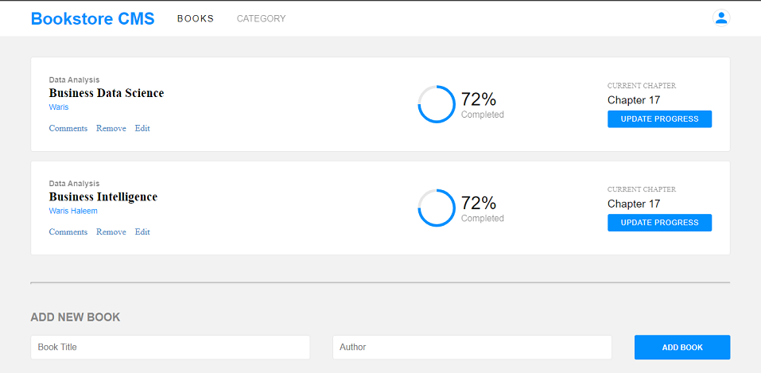

# React App: Bookstore CMS

> The Bookstore is a website built using React and Redux.
> This MVP version of the App allows you to:

> * Display a list of books.
> * Add a book.
> * Remove a selected book.

> This app is developed using React, Redux and API"



## Built With

- **HTML**
- **CSS**
- **JavaScript**
- **Gitflow**
- **React**
- **Redux**
- **API**

## Getting Started

### Steps to run the project

#### 1 - Git Clone.

```
git clone https://github.com/iAmWaris97/Bookstore.git
```
#### 2 - Install node packages.

```
npm install
```

#### 3 - run the project

```
npm start
```

## Available Scripts

In the project directory, you can run:

### `npm start`

Runs the app in the development mode.

### `npm test`

Launches the test runner in the interactive watch mode.

### `npm run build`

Builds the app for production to the `build` folder.

### `npm run eject`

**Note: this is a one-way operation. Once you `eject`, you can't go back!**

If you aren't satisfied with the build tool and configuration choices, you can `eject` at any time. This command will remove the single build dependency from your project.

## Author
### 👨‍💻 Waris Haleem
- GitHub: [@iAmWaris97](https://github.com/iAmWaris97)
- Twitter: [@iAmWaris97](https://twitter.com/iAmWaris97)
- LinkedIn: [Waris Haleem](https://www.linkedin.com/in/waris-haleem/)

## Acknowledgments

> Special thanks to the co-creator of Redux (Dan Abramov) for his complete course on redux actions and store methodes.

## 🤝 Contributing

Contributions, issues, and feature requests are welcome!

Feel free to check the [issues page](../../issues/).

## Show your support

Please give a ⭐️ if you like this project!

## 📝 License
- This project is [MIT](./LICENSE) licensed.